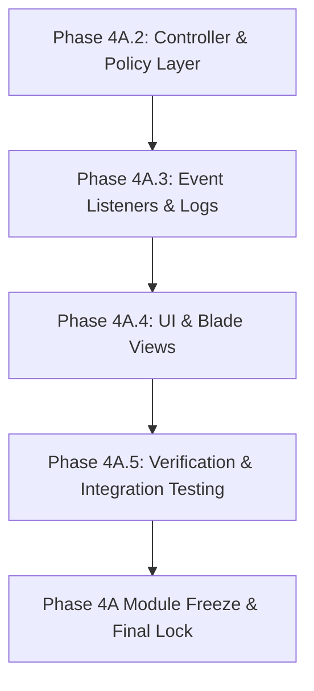

# PHASE 4A CONTEXT HANDOVER – DEVELOPER CONTEXT DOCUMENT

Dokumen ini berfungsi sebagai **Single Source of Context (SsoC)** untuk melanjutkan siklus pengembangan Modul Keuangan SIM RW 047 pada percakapan baru. Dokumen ini mendefinisikan status terkini, seluruh keputusan arsitektural yang telah dikunci, serta metodologi baru yang akan digunakan untuk mempercepat rilis fitur menuju deadline.

---

## 1. Executive Summary

Pengembangan Modul Keuangan SIM RW 047 saat ini berada pada akhir **Phase 4A.1 - Foundation & Service Layer**. Seluruh pondasi data, domain model, query scope, penanganan konkurensi (pessimistic locking), dan service inti (`LedgerService` dan `ContributionService`) telah selesai dibangun, divalidasi, dan **DIBEKUKAN (Service Layer Freeze)**. 

Posisi proyek saat ini siap memasuki **Phase 4A.2 - Controller & Policy Layer**. Seluruh keputusan arsitektur yang dibuat selama fase fondasi bersifat mengikat dan tidak boleh diubah tanpa instruksi eksplisit dari pemilik sistem.

---

## 2. Current Project State

* **Framework:** Laravel 10.x (PHP 8.x)
* **Database:** MySQL / MariaDB dengan optimasi *Composite Unique Index* dan *Pessimistic Locking*.
* **Architecture Pattern:** Clean Architecture dengan separation of concerns yang memisahkan Controller/Request (HTTP Layer), Service Layer (Business Logic Layer), dan Model Layer (Domain Data Layer).
* **Core System Status:** **Frozen & Locked** (Sistem autentikasi, manajemen KK, dan manajemen Warga telah berjalan stabil).
* **Financial Module Status:** **Foundation Locked, Service Layer Frozen**. 

---

## 3. Phase 4A Progress Matrix

| Sub-Phase | Nama Modul / Kegiatan | Deliverables | Status | Keterangan |
| :--- | :--- | :--- | :--- | :--- |
| **Phase 4A.1.1** | Database Layer | Migration files & Database schema | **LOCKED** | Skema tabel `financial_transactions`, `catatan_iuran_wargas`, `iuran_types` selesai diaudit. |
| **Phase 4A.1.2A**| Domain Model Layer | Eloquent Models (`IuranType`, `FinancialTransaction`, `CatatanIuranWarga`) | **LOCKED** | Representasi relasi, casting, dan helper sederhana. |
| **Phase 4A.1.2B**| Query Scope & Enhancement | Eloquent Scopes | **LOCKED** | Reusable queries (`pending()`, `approved()`, `byRt()`, dll.). |
| **Phase 4A.1.2C**| Model Audit & Lock | Final Audit Model | **LOCKED** | Memastikan keselarasan model dengan skema database. |
| **Phase 4A.1.3A**| Service Layer Foundation| Base Services | **LOCKED** | Pendefinisian struktur dependency injection dan exception handling. |
| **Phase 4A.1.3B**| Universal Ledger Core | `LedgerService` | **LOCKED** | Core ledger engine (`createIncome`, `createExpense`, `createAdjustment`). |
| **Phase 4A.1.3C**| Contribution Service | `ContributionService` & Events | **LOCKED** | Registrasi dan audit iuran manual (`recordContribution`, `validateContribution`, `invalidateContribution`). |

---

## 4. Architecture Decisions (ADR)

### ADR 01: Universal Ledger Pattern
* **Keputusan:** Seluruh transaksi finansial di tingkat RW maupun RT wajib dicatat dalam satu ledger universal (`financial_transactions`).
* **Alasan:** Menjamin integritas data keuangan tunggal dan memudahkan rekonsiliasi kas tanpa data silang yang membingungkan.

### ADR 02: Polymorphic Relation for Ledger References
* **Keputusan:** Tabel `financial_transactions` menggunakan kolom `reference_type` dan `reference_id` untuk menghubungkan mutasi dengan data administrasi seperti `catatan_iuran_wargas`.
* **Alasan:** Menghindari *orphan ledger* dan mempermudah pelacakan dokumen sumber (source documents) dari setiap transaksi kas.

### ADR 03: Manual Contribution Workflow Only
* **Keputusan:** Modul Keuangan SIM RW 047 **tidak memiliki** payment gateway, auto-settlement, upload bukti transfer, QRIS, maupun verifikasi digital. Pembayaran iuran dilakukan secara tunai/luring (offline) langsung kepada Ketua RT, lalu dicatat secara manual ke sistem oleh RT.
* **Alasan:** Ruang lingkup sistem adalah *Sistem Informasi Administrasi RW*, bukan aplikasi akuntansi penuh atau sistem e-payment.

### ADR 04: Pessimistic Locking Strategy
* **Keputusan:** Operasi validasi (`validateContribution`), pembatalan (`invalidateContribution`), dan pembuatan nomor urut transaksi (`generateTransactionNumber`) wajib menggunakan `lockForUpdate()`.
* **Alasan:** Mencegah terjadinya *race condition* atau *double update* saat pengurus RT/RW melakukan input bersamaan.

### ADR 05: Post-Commit Event Dispatching
* **Keputusan:** Event (`ContributionRecorded`, `ContributionValidated`, dll.) hanya di-dispatch setelah transaksi database sukses di-commit (`DB::afterCommit`).
* **Alasan:** Mencegah pengiriman notifikasi/log apabila transaksi database mengalami rollback.

### ADR 06: Eager Loading Event Payload
* **Keputusan:** Objek model yang dikirim sebagai payload event wajib memuat relasi terkait yang telah di-eager load sebelum dispatch.
* **Alasan:** Mengeliminasi celah performa berupa masalah *N+1 Query* di tingkat Event Listener.

---

## 5. Locked Components

Bagian-bagian berikut telah berstatus **LOCKED** dan **tidak boleh diubah** kecuali ditemukan bug kritis atau ada instruksi tertulis langsung dari user:
1. **Migration Files & DB Schema** untuk Modul Keuangan.
2. **Model Files & Scopes:** [CatatanIuranWarga.php](file:///c:/Users/Admin/Documents/SKRIPSI%20ONGOING/Program%20Web%20RW%20047/versi%202/app/Models/CatatanIuranWarga.php), [FinancialTransaction.php](file:///c:/Users/Admin/Documents/SKRIPSI%20ONGOING/Program%20Web%20RW%20047/versi%202/app/Models/FinancialTransaction.php), dan [IuranType.php](file:///c:/Users/Admin/Documents/SKRIPSI%20ONGOING/Program%20Web%20RW%20047/versi%202/app/Models/IuranType.php).
3. **Services:** [LedgerService.php](file:///c:/Users/Admin/Documents/SKRIPSI%20ONGOING/Program%20Web%20RW%20047/versi%202/app/Services/LedgerService.php) dan [ContributionService.php](file:///c:/Users/Admin/Documents/SKRIPSI%20ONGOING/Program%20Web%20RW%20047/versi%202/app/Services/ContributionService.php).
4. **Events:** Seluruh event pada `App\Events` yang berelasi dengan finansial.

---

## 6. Source of Truth Documents

Untuk semua implementasi lanjutan, gunakan dokumen-dokumen baseline berikut yang terletak di folder konfigurasi/arsip:
1. `FINANCIAL_FINAL_BASELINE.md` – Kebijakan bisnis dan rancangan fitur utama modul keuangan.
2. `FINANCIAL_DOMAIN_LOCK.md` – Batasan kosa kata domain, melarang terminologi digital payment.
3. `FINANCIAL_TECHNICAL_SPECIFICATION.md` – Struktur database, index, dan spesifikasi concurrency.
4. `FINANCIAL_DEVELOPMENT_GUIDELINES.md` – Standar coding Laravel, penamaan class, dan arsitektur layer.
5. `FINANCE_POLICY_MATRIX.md` – Matriks hak akses untuk keuangan (RT vs RW vs Warga).
6. `FINANCIAL_DATABASE_DESIGN.md` – Skema relasi database dan tipe data kolom.

---

## 7. Current Codebase Status

### Selesai Diimplementasikan:
* Skema database Modul Keuangan (Migrations).
* Model Eloquent lengkap dengan Casting, Relationship, dan Scopes.
* `LedgerService` dengan fitur atomic transactions, sequential trx number generation, balance calculator, dan reversal system.
* `ContributionService` dengan fitur pencatatan iuran (dengan pengecekan RT scope, nominal positif, dan pencegahan duplikasi data periode), persetujuan iuran, dan pembatalan iuran.
* Obsolete `PaymentService` telah **dihapus** sepenuhnya.
* Event classes: `FinancialTransactionCreated`, `FinancialAdjustmentCreated`, `ContributionRecorded`, `ContributionValidated`, dan `ContributionInvalidated`.

### Belum Dibuat:
* HTTP Controller (`LedgerController`, `ContributionController`).
* Form Requests untuk validasi input HTTP.
* Authorization Policies (`LedgerPolicy`, `ContributionPolicy`).
* Web Routes untuk mendaftarkan endpoint HTTP.
* Event Listeners untuk mencatat log aktivitas (`ActivityLog` / `AuditTrail`) dan notifikasi (Telegram).
* UI / Blade template untuk dashboard RT, dashboard RW, serta form input iuran warga.

---

## 8. Remaining Development Roadmap

---

## 9. New Development Methodology: FICA

Metode pengembangan resmi kini diubah dari alur analisis panjang menjadi:

### **Fast Implementation with Controlled Audit (FICA)**

#### Mengapa Metodologi Ini Diadopsi?
1. **Arsitektur Matang:** Seluruh fondasi arsitektur dan database telah terkunci kokoh.
2. **Service Layer Freeze:** Logika bisnis terdalam telah selesai diuji dan dikunci.
3. **Deadline Presentasi:** Sisa waktu pengembangan tinggal sekitar 1 minggu.
4. **Fokus:** Beralih dari eksplorasi arsitektural menjadi penyelesaian fitur (*feature completion*) dan stabilisasi proyek.

#### Prinsip Kerja FICA:
* **Workflow Normal:** 
  $$\text{Implementation Plan + Code Implementation} \rightarrow \text{Comprehensive Audit} \rightarrow \text{LOCK}$$
* **Workflow Layer Sederhana (misal Router / Form Request):** 
  $$\text{Code Implementation} \rightarrow \text{Post-Implementation Audit & Verify}$$
* Mengurangi birokrasi penulisan plan untuk tweak minor guna memaksimalkan waktu menulis kode yang bersih dan fungsional.

---

## 10. Working Rules for Future Conversations

1. **Protect the Lock:** Jangan pernah mengubah file di bawah folder `app/Services/LedgerService.php`, `ContributionService.php`, migrations keuangan, dan model-model keuangan kecuali diperintahkan langsung atau memperbaiki bug kritis.
2. **K.I.S.S (Keep It Simple, Stupid):** Pilih pendekatan Laravel bawaan yang paling sederhana dan stabil. Hindari *over-engineering* seperti menambahkan *repository pattern* di atas Service Layer.
3. **Follow the Policy Matrix:** Pastikan otorisasi di tingkat controller dan policy mengikuti `FINANCE_POLICY_MATRIX.md` (misal: RT hanya boleh mencatat iuran warga di RT-nya, RW memvalidasi administrasi secara global).
4. **Maintain Clean Code:** Gunakan tipe data eksplisit (type-hinting), kembalikan tipe data yang jelas pada method controller, dan hindari penggunaan helper global Laravel yang berlebihan.

---

## 11. Next Immediate Objective

**Sasaran Segera pada Percakapan Baru:**

### **PHASE 4A.2 – Controller & Policy Layer**
1. Buat **Form Requests** untuk memvalidasi input HTTP pencatatan iuran.
2. Buat **Laravel Policies** (`LedgerPolicy` dan `ContributionPolicy`) untuk melindungi endpoint sesuai matriks otorisasi.
3. Buat **Controllers** (`LedgerController` dan `ContributionController`) yang memanggil `ContributionService` dan `LedgerService`.
4. Daftarkan **Web Routes** yang aman.
